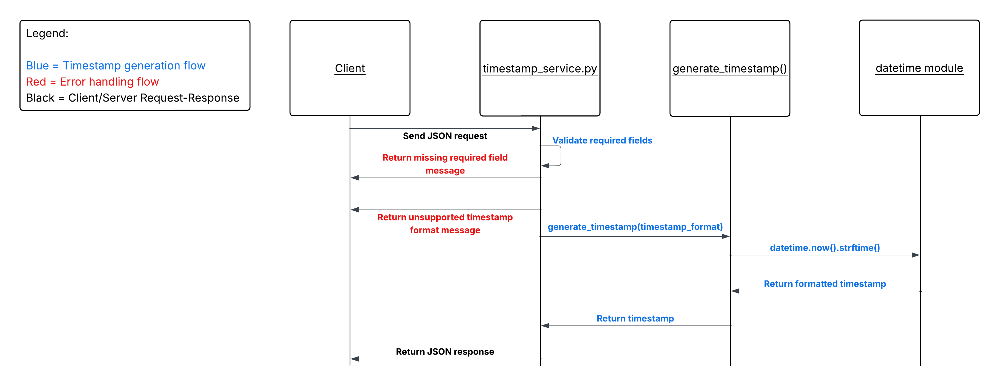

A. Timestamp-Microservice
The Timestamp Microservice generates formatted timestamps and returns them as JSON responses. Applications can send a request containing user and formatting information, and the microservice will respond with either a formatted timestamp or an error message.

B. To programmatically REQUEST data from the microservice: A program connects to it using ZeroMQ. It sends a message in JSON format that includes the required information: 

- app_name: Name of the application making the request
- user_id: Unique identifier for the user
- timestamp_format: Desired format of the generated timestamp

Supported timestamp formats:

MM/DD/YYYY HH:MM:SS AM/PM
MM-DD-YYYY HH:MM:SS AM/PM
MM/DD/YYYY HH:MM:SS
MM-DD-YYYY HH:MM:SS
DD/MM/YYYY HH:MM:SS AM/PM
DD-MM-YYYY HH:MM:SS AM/PM
DD/MM/YYYY HH:MM:SS
DD-MM-YYYY HH:MM:SS

If timestamp_format is an empty string (""), the service defaults to:
MM/DD/YYYY HH:MM:SS AM/PM

The microservice uses this information to generate a timestamp or return an error message.

The service returns an error message if:

- app_name is missing
- user_id is missing
- timestamp_format is missing
- timestamp_format is not one of the supported formats

Example:
```
{
    "message": "Missing required field: app_name"
}
```

Example Request Code:
```
import json
import zmq

# Create a ZeroMQ context and request socket
context = zmq.Context()
socket = context.socket(zmq.REQ)

# Connect to the timestamp microservice
socket.connect("tcp://localhost:5555")

# Build request message
request = {
    "app_name": "Task Manager",
    "user_id": "user123",
    "timestamp_format": "MM-DD-YYYY HH:MM:SS AM/PM"
}

socket.send_string(json.dumps(request))
```
Explanation:
1. ZeroMQ context and REQ socket are created.
2. The client connects to the microservice at tcp://localhost:5555.
3. JSON request is constructed with the required fields.
4. The request is converted to a JSON string and sent to the microservice.

C. To programmatically RECEIVE data from the microservice: After sending a request, the program waits for a response from the microservice. The response comes back as a JSON string. The program then converts it into a Python dictionary so it can be used or printed. 


Example Response Code:
```
response = socket.recv_string()
data = json.loads(response)

print(data)
```
Example Successful Response:
```
{
    "app_name": "Task Manager",
    "user_id": "user123",
    "timestamp_format": "MM-DD-YYYY HH:MM:SS AM/PM",
    "timestamp": "12-05-2025 03:45:12 PM"
}
```
Response Fields:
- app_name: Name of the application that sent the request.
- user_id: User identifier provided in the request.
- timestamp_format: Timestamp format requested by the client.
- timestamp: The generated timestamp returned by the microservice.


Example Error Response:
```
{
    "message": "Unsupported timestamp format"
}
```

Explanation:
1. recv_string() waits for a response from the microservice.
2. json.loads() converts the JSON string into a Python dictionary.
3. The application can access the returned values using dictionary keys such as timestamp or message.


D. UML sequence diagram

